##### 4.14

counterfact可能会导致幻觉，更严格，触发的冲突更多（要做实验验证吗？）。

他们是怎么用counterfact的？

##### 4.15

知识都存到哪里了，某一个W里存了哪些知识？知道后才能用局部性去约束更多的知识正确。

##### 4.29

看了几天论文后，终于动笔了。但走了一个弯路，ROME只允许修改单条知识。而我要把相同主语不同关系的样例也加入到约束项中进行优化。

数据约束上一共有三种方式：

1. 直接扩展K,V，这样也不用重新计算C,但是ROME不支持，这是MEMIT做的事。行不通，没意义。
2. 另外添加||WK-V||，这样需要重新计算C=C+KK，好算，但我还没找到原代码里面是如何计算的。
3. 加入到KL里面，去掉ground标签。现在打算做这个，因为上述两种就是作弊，不符合科学思维。

算法改进上：

1. 直接往后移1层进行修改，看会如何？这个只能做测试用
2. 捣毁关系embedding，找到关系的定位层，在之后做修改，计算v。

##### 5.1

略微修改了原代码中的数据处理方式，增加了{}，消除了报错

##### 5.2

`rome_main.py` 86

`compute_v`68、112

`editor.py`468、503

数据约束跑通了

增加了数据集的incident项，`/home/hsong/BS/DATA/KnowEdit-huggingface/benchmark/ZsRE/ZsRE-test-all_incident.json`

方便当作附加条目送入request


sbatch了mode1 MUL_LOC=False\mode2 MUL_LOC=False

##### 5.3

成功sbatch了mode1mode2的所有

现在计划扩展别的数据集，这需要对关系随机采样，然后拼成新的prompt

- TODO 等任务跑完记得开clash把这些都git push了5.3
- TODO 原始数据再跑一次

git新分支algo_improve

**如果只用数据的话，就完全不够了，因为持续学习很依赖数据，数据增强。训练范式。**

**我更期望用另一种解释方案来使得元学习得到改进，从理解大模型内部参数的实际作用关系开始，包括如何对数据建模，对任务建模。**

- TODO 关系建模
- TODO 应用
- TODO 推理增强


太爽啦！

```bash
find . -type d ! -name 'EasyEdit' ! -name '.git' ! -name '.' ! -name '..' -exec rm -r -f {} \;
```

全给删了，渣都不剩。GLM巨坑：name是以单个目录为单位进行匹配的，包括了文件夹。

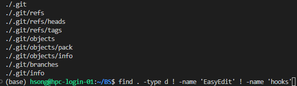

这样hooks就被隐藏了。

下面这样就没有：
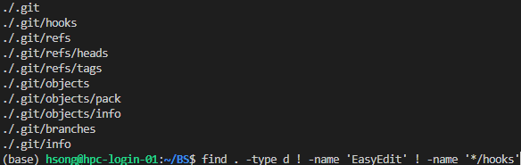

因为没有‘/hooks’的文件或目录名字

但是path就可以：
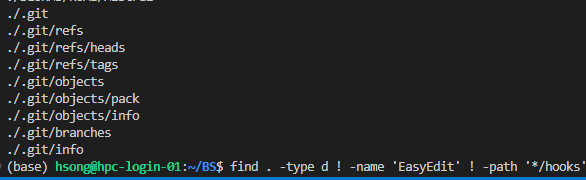

但是.git的子目录被删了。

正确应该如下

```bash
find . -type d ! -path '*/EasyEdit*'  ! -path '*/.git*'
```


[Linux find 命令 | 菜鸟教程 (runoob.com)](https://www.runoob.com/linux/linux-comm-find.html)


每次新copy后记得改hparam中的模型路径和device

"EleutherAI/gpt-j-6b"

0


##### 5.4

huozi3是指令微调后的，所以会有ChatGM格式的输出，不如直接用

```
 "/home/share/models/Chinese-Mixtral-8x7B"
```


**问题：输出token不连贯。**


```python
import torch
from transformers import AutoModelForCausalLM, AutoTokenizer
import argparse


if __name__ == "__main__":
    
    parser = argparse.ArgumentParser()
    parser.add_argument('-d', '--debug', action='store_true', help='debug mode')
    args, _ = parser.parse_known_args()
    if args.debug:
        # if you use vscode on hpc-login-01
        import debugpy
        
        debugpy.connect(('192.168.1.50', 6789))
        debugpy.wait_for_client()
        debugpy.breakpoint()

    model_id = "/home/share/models/Chinese-Mixtral-8x7B"
    tokenizer = AutoTokenizer.from_pretrained(model_id)

    model = AutoModelForCausalLM.from_pretrained(model_id, device_map="auto")

    text = "美国总统是"
    inputs = tokenizer(text, return_tensors="pt",padding=True).to(0)

    outputs = model.generate(**inputs, max_new_tokens=20)
    print(tokenizer.decode(outputs[0], skip_special_tokens=True))

```


```

[1, 28705, 50752, 28971]
['<s>','','美国总统','是']

[28705, 39118, 49289, 36027]
['','本文','特朗普','美国的']
```


```
tokenizer.add_special_tokens({'pad_token': '[PAD]'})*
```


```
text = "美国总统是"
inputs = tok(text, return_tensors="pt",padding=True).to(0)
outputs = model(**inputs)
logits = output.logits
lom = torch.argmax(logits,dim=-1)
llom = lom.detach().clone().tolist()
tok.decode(llom[0])
```

##### 5.6

###### 1、

```
给llama3-8b：你是一个家庭智能代理，经常和用户交流，你有可能输出一些错误的知识会误导用户，这时候用户会告诉你正确答案，你需要判断用户的话是否有想纠错你的意图，如果有，请只回复‘有’，否则只回复‘无’，不准有其它的输出，以下是用户的话：
你好啊
```

###### 2、

```
你是一个家庭智能代理，经常和用户交流，你有可能输出一些错误的知识会误导用户，这时候用户会告诉你正确答案，你需要判断用户的话是否有想纠错你的意图，如果有，请只回复‘有’，否则只回复‘无’，不准有其它的输出，我给你一些示例，用户说'你说的不对，红楼梦的作者是曹雪芹'，你需要回答'有'；用户说'请介绍一下乔丹'，你需要回答'无'；用户说'不对啊乔丹是打篮球的'，你需要回答'有'。以下是用户的话：请介绍一下乔丹
```

###### 3、

```
    task = ("你是一个家庭智能代理，经常和用户交流，"
    "在和用户交谈的过程中，用户可能会希望你修改你的认知，你需要判断用户是否想让你修改你的认知的意图"
    "如果有，请只回复‘有’，否则只回复‘无’，不准有其它的输出，"
    "我给你一些示例，"
    "用户说'你说的不对，红楼梦的作者是曹雪芹'，你需要回答'有'；"
    "用户说'请介绍一下乔丹'，你需要回答'无'；"
    "用户说'不对啊乔丹是打篮球的'，你需要回答'有'。"
    "用户说'我想修改一下，小红的爸爸是小蓝',你需要回答'有'。"
    "以下是用户的话：\n")

你是一个家庭智能代理，经常和用户交流，在和用户交谈的过程中，用户可能会希望你修改你的认知，你需要判断用户是否想让你修改你的认知的意图如果有，请只回复‘有’，否则只回复‘无’，不准有其它的输出，我给你一些示例，用户说'你说的不对，红楼梦的作者是曹雪芹'，你需要回答'有'；用户说'请介绍一下乔丹'，你需要回答'无'；用户说'不对啊乔丹是打篮球的'，你需要回答'有'。用户说'我想修改一下，小红的爸爸是小蓝',你需要回答'有'。以下是用户的话：
```

##### 5.9

凌晨花了4h写了接上了edit的交互基本逻辑（还没跑通）

还没写UI。

五点了还没写好。爆内存了。


记录一下内存位置

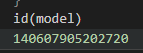

请修改一下宋浩喜欢打篮球

请问宋浩喜欢什么运动？

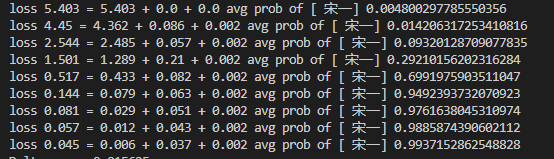

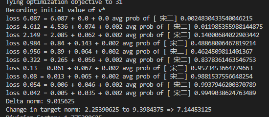

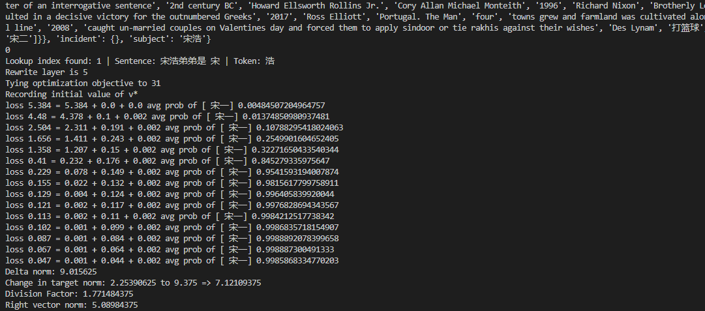

发现插入偏僻的新知识效果不好。

请修改爱因斯坦的专业是舞蹈


- 申请服务器gpu节点，运行`server.py`

- windows终端运行：

```powershell
ssh -L 12345:gpu09:12345 hpc
```

- 运行交互界面`BSclient.py`：

```python
import gradio as gr
import socket
def client_message(message, history):
    # 创建一个 TCP 客户端
    client = socket.socket(socket.AF_INET, socket.SOCK_STREAM)
    client.connect(('localhost', 12345))  # 服务器地址和端口

    # 发送消息到服务器
    client.send(message.encode('utf-8'))
    # 接收服务器的回复
    response = client.recv(1024).decode('utf-8')
    client.close()

    # 更新聊天历史
    history.append(message)
    history.append(response)
    return history

# 创建 Gradio 界面
iface = gr.Interface(
    fn=client_message,
    inputs="text",
    outputs="text",
    title="聊天客户端",
    description="与服务器聊天"
)
# 启动 Gradio 应用
iface.launch()
```

- windows打开浏览器，输入`http://127.0.0.1:7860`


##### 5.10

一版能稳定运行的服务器端：

```python

import asyncio
import socket

async def handle_client(reader, writer):
    client_address = writer.get_extra_info('peername')
    print(f'Connected to client at {client_address[0]}:{client_address[1]}')

    while True:
        try:
            data = await reader.read(1024)
            message = data.decode().strip()
            if not message:
                print("No message received from client.")
                break
            print(f"Received message from client: {message}")
            # 在这里添加逻辑来处理客户端发送的消息，然后构造响应
            # 这里只是一个示例，可以根据需要进行修改
            
            
            
            
            
            response = "Hello from server!"
            writer.write(response.encode())
            
            await writer.drain()
        except Exception as e:
            print(f"An error occurred: {e}")
            break

    writer.close()
    await writer.wait_closed()

async def main():
    server_ip = '192.168.1.108'  # 服务器的IP地址
    server_port = 22223  # 服务器的端口号

    server = await asyncio.start_server(
        handle_client, server_ip, server_port)

    print(f'Server is listening on {server_ip}:{server_port}')

    async with server:
        await server.serve_forever()

asyncio.run(main())

```


客户端

```python
import gradio as gr
import socket
import random
import time

# 客户端配置
client_ip = '127.0.0.1'  # 服务器的IP地址
client_port = 22223  # 服务器的端口号
client_socket = socket.socket(socket.AF_INET, socket.SOCK_STREAM)
client_socket.connect((client_ip, client_port))
print(f'Connected to server at {client_ip}:{client_port}')
client_socket.settimeout(10)
# 设置超时时间为 10 秒

# 发送消息给服务器的函数
def send_message(message):
    client_socket.sendall(message.encode('utf-8'))

# 从服务器接收消息的函数
def receive_message():
    messages = []
    try:
        while True:
       
            data = client_socket.recv(1024).decode('utf-8')
            if data:
                messages.append(data)
            else:
                # 如果没有接收到数据，跳出循环
                break
    except socket.timeout:
        pass
        
    return messages

with gr.Blocks() as demo:
    chatbot = gr.Chatbot() # 对话框
    msg = gr.Textbox() # 输入文本框
    clear = gr.ClearButton([msg, chatbot]) # 清除按钮
    # def chat_bot(message, chat_history):
    #     send_message(message)
    #     response = receive_message()
    #     if response is None:
    #         return "No response from server"
        
    #     chat_history.append((message, response))
    #     time.sleep(0.5)
    #     return "", chat_history
    def chat_bot(message, chat_history):
        send_message(message)
        responses = receive_message()
        if not responses:
            chat_history.append((message, "No response from server"))
        else:
            for response in responses:
                chat_history.append((message, response))
                time.sleep(0.5)  # 模拟延迟
        return "", chat_history

    msg.submit(chat_bot, [msg, chatbot], [msg, chatbot])
    
demo.launch()


# def chat_bot(message):
#     send_message(message)
#     response = receive_message()
#     if response is None:
#         return "No response from server"
#     return response

# iface = gr.Interface(fn=chat_bot, inputs="textbox", outputs="textbox", title="ChatBot")
# iface.launch()

```


知识编辑综述：

[面向大语言模型的知识编辑：(三) 知识编辑任务定义及方法分类 - 知乎 (zhihu.com)](https://zhuanlan.zhihu.com/p/681532011)

##### 5.11

```python


import os
import sys
sys.path.append('/home/hsong/BS/EasyEdit')
import json
import random
from easyeditor import (
    FTHyperParams, 
    IKEHyperParams, 
    KNHyperParams, 
    MEMITHyperParams, 
    ROMEHyperParams, 
    LoRAHyperParams,
    MENDHyperParams,
    SERACHparams
    )
from easyeditor import BaseEditor
from easyeditor.models.ike import encode_ike_facts
from sentence_transformers import SentenceTransformer
from easyeditor import ZsreDataset

import math, random, time, argparse
from typing import Tuple, Dict, List
from copy import deepcopy
from utils import *
from transformers import AutoTokenizer, AutoModelForCausalLM
import argparse
import transformers
import torch
import time
import logging
import re
import asyncio
import socket

parser = argparse.ArgumentParser()
parser.add_argument('-d', '--debug', action='store_true', help='debug mode')
args, _ = parser.parse_known_args()
if args.debug:
    # if you use vscode on hpc-login-01
    import debugpy
    debugpy.connect(('192.168.1.50', 6789))
    debugpy.wait_for_client()
    debugpy.breakpoint()

# 禁用 WARN 级别的日志
logging.disable(logging.WARNING)

import os
from transformers import AutoTokenizer, AutoModelForCausalLM
model_id="./MODELS/models--FlagAlpha--Llama3-Chinese-8B-Instruct/snapshots/d76c4a5d365b041d1b440337dbf7da9664a464fc"
model_save_path="./MODELS/models--FlagAlpha--Llama3-Chinese-8B-Instruct"
class ModelManager:
    def __init__(self, model_id: str="./MODELS/models--FlagAlpha--Llama3-Chinese-8B-Instruct/snapshots/d76c4a5d365b041d1b440337dbf7da9664a464fc",
                model_save_path: str="./MODELS/models--FlagAlpha--Llama3-Chinese-8B-Instruct"):
        
        self.model_id = model_id
        self.model_save_path = model_save_path
        
        self.pipeline = None
        self.terminators = None
        self.model = None
        self.tokenizer = None
        self.load_method = "pipeline"  # 默认使用 pipeline 方法
        
        # 尝试加载模型和分词器
        self.load_model()

    def load_model(self):
        if self.model is None:
            if self.load_method == "from_pretrained":
                self.model = AutoModelForCausalLM.from_pretrained(self.model_id)
                self.tokenizer = AutoTokenizer.from_pretrained(self.model_id)
                
            elif self.load_method == "pipeline":
                pipeline = transformers.pipeline(
                    "text-generation",
                    model=self.model_id,
                    model_kwargs={"torch_dtype": torch.float16,"do_sample": False},
                    device="cuda",
                )
                self.pipeline = pipeline
                self.model = self.pipeline.model
                self.tokenizer = self.pipeline.tokenizer
                
                
                self.terminators = [
                    self.pipeline.tokenizer.eos_token_id,
                    self.pipeline.tokenizer.convert_tokens_to_ids("<|eot_id|>")
                ]

    def save_a_model(self,new_model:object):
        if new_model is not None:
            new_model.save_pretrained(self.model_save_path)
            new_tokenizer.save_pretrained(self.model_save_path)
            print("模型保存成功！")
        else:
            print("模型尚未加载，无法保存。")
            
    def del_then_reload_model(self):
        # 从内存中删除原来的模型
        if self.model is not None:
            del self.model
            del self.tokenizer
            del self.pipeline
        
        # 重新加载模型
        self.load_model()
    def get_model(self):
        if self.model is None:
            self.load_model()
        return self.model
    
    def get_pipeline(self):
        if self.pipeline is None:
            self.load_model()
        return self.pipeline
    
    def get_tokenizer(self):
        if self.tokenizer is None:
            self.load_model()
        return self.tokenizer
    def get_terminators(self):
        if self.terminators is None:
            self.load_model()
        return self.terminators

# 使用示例
model_manager = ModelManager()

MODEL = model_manager.get_model()
TOKENIZER = model_manager.get_tokenizer()
MODEL_NAME = MODEL.config._name_or_path if hasattr(MODEL.config, '_name_or_path') else None
terminators = model_manager.get_terminators()
pipeline = model_manager.get_pipeline()

def send(msg:str):
    TMP = "USER>>"
    print(f'send {msg} to user')
    return msg
def receive():
    try:
        # 尝试以 utf-8 编码读取输入
        msg = input(f"\033[34mUSER>>\033[0m")
    except UnicodeDecodeError:
        print("编码失败，请重新输入")
        import sys
        msg = input(f"\033[34mUSER>>\033[0m").encode(sys.stdin.encoding, errors='ignore').decode('utf-8', errors='ignore')

    print(f'receive {msg} from user')
    return msg
    

class MyEditor:
    def __init__(
        self,
        editing_method:str='FT', 
        model_name:str='Llama3-Chinese-8B-Instruct', 
        reverse:bool=True  # 可逆修改,需要保存修改值
    ):
        assert(editing_method in ['FT','LoRA','KN', 'ROME', 'MEMIT', 'PMET'])
        self.editing_method = editing_method
        assert(model_name in ['gpt-j-6B','mistral-7b',"Llama3-Chinese-8B-Instruct","Chinese-Mixtral-8x7B"])
        self.model_name = model_name

        self.hparams_dir = f'/home/hsong/BS/EasyEdit/hparams/{self.editing_method}/{self.model_name}'
        
        self.editing_hparams = None  # CLASS
        self.hparams = None          # METHOD

        the_method = self.editing_method
        
        if the_method == 'FT':
            self.editing_hparams = FTHyperParams
        elif the_method == 'IKE':
            self.editing_hparams = IKEHyperParams
        elif the_method == 'KN':
            self.editing_hparams = KNHyperParams
        elif the_method == 'MEMIT':
            self.editing_hparams = MEMITHyperParams
        elif the_method == 'ROME':
            self.editing_hparams = ROMEHyperParams
        elif the_method == 'LoRA':
            self.editing_hparams = LoRAHyperParams
        else:
            raise NotImplementedError
        
        self.hparams = self.editing_hparams.from_hparams(self.hparams_dir)
    def do_edit(self, params: Dict)-> Tuple[object, object]:
        editor = BaseEditor(self.hparams, MODEL, TOKENIZER, MODEL_NAME)  #take long time 1-2min
        
        # if self.args_dict["Editing Method"] in ['MEMIT', 'PMET']:
        #     metrics, edited_model, _ = editor.batch_edit(**params)
        if self.editing_method in ['KN', 'ROME','FT','LoRA','MEMIT', 'PMET']:
            metrics, edited_model, _ = editor.edit(**params)
        else:
            raise ValueError(f"Unsupported Editing Method: {self.args_dict['Editing Method']}")
        
        
        return metrics, edited_model
    

def intend_detector(txt:str,pipiline:object=pipeline)->str:
    
    global MODEL
    global TOKENIZER
    global MODEL_NAME
    global terminators
    global pipeline
    # MODEL = model_manager.get_model()
    # TOKENIZER = model_manager.get_tokenizer()
    # MODEL_NAME = MODEL.config._name_or_path if hasattr(MODEL.config, '_name_or_path') else None
    # terminators = model_manager.get_terminators()
    # pipeline = model_manager.get_pipeline()

    messages = [{"role": "system", "content": ""}]
    task = ("你是一个家庭智能代理，经常和用户交流，"
    "在和用户交谈的过程中，用户可能会希望你修改你的认知，你需要判断用户是否想让你修改你的认知的意图"
    "如果有，请只回复‘有’，否则只回复‘无’，不准有其它的输出，"
    "我给你一些示例，"
    "用户说'你说的不对，红楼梦的作者是曹雪芹'，你需要回答'有'；"
    "用户说'请介绍一下乔丹'，你需要回答'无'；"
    "用户说'不对啊乔丹是打篮球的'，你需要回答'有'。"
    "用户说'我想修改一下，小红的爸爸是小蓝',你需要回答'有'。"
    "用户说'红楼梦作者是谁',你需要回答'无'"
    "用户说'罗马位于哪里',你需要回答'无'"
    "用户说'y',你需要回答'无'"
    "用户说'n',你需要回答'无'"
    "以下是用户的话：\n")
    #print(task)
    
    messages.append(
                    {"role": "user", "content": task + txt}
                )
    prompt = pipeline.tokenizer.apply_chat_template(
            messages, 
            tokenize=False, 
            add_generation_prompt=True
        )

    outputs = pipeline(
        prompt,
        max_new_tokens=10,
        eos_token_id=terminators,
        do_sample=True,
        temperature=0.01,
        top_p=0.9
    )
    content = outputs[0]["generated_text"][len(prompt):]
    print("\033[33mAgent Indentent Detector:\033[0m",content)
    
    return content

messages_qa = [{"role": "system", "content": "你是一个家庭智能代理，你名字叫小绿，经常和用户交流"}]
def chatter(txt:str,pipiline:object=pipeline)->None:
    global messages_qa
    global MODEL
    global TOKENIZER
    global MODEL_NAME
    global terminators
    global pipeline
    # MODEL = model_manager.get_model()
    # TOKENIZER = model_manager.get_tokenizer()
    # MODEL_NAME = MODEL.config._name_or_path if hasattr(MODEL.config, '_name_or_path') else None
    # terminators = model_manager.get_terminators()
    # pipeline = model_manager.get_pipeline()
    
    messages_qa.append(
                    {"role": "user", "content": txt}
                )
    prompt = pipeline.tokenizer.apply_chat_template(
            messages_qa, 
            tokenize=False, 
            add_generation_prompt=True
        )
    outputs = pipeline(
        prompt,
        max_new_tokens=512,
        eos_token_id=terminators,
        do_sample=True,
        temperature=0.6,
        top_p=0.9
    )
    content = outputs[0]["generated_text"][len(prompt):]
    messages_qa.append(
                    {"role": "system", "content": content}
                )
    print("\033[33mAgent Chat<<\033[0m",content)  # Llama3-Chinese-8B-Instruct
    return content
def RE(txt:str,pipiline:object=pipeline)->None:
    
    global MODEL
    global TOKENIZER
    global MODEL_NAME
    global terminators
    global pipeline
    # MODEL = model_manager.get_model()
    # TOKENIZER = model_manager.get_tokenizer()
    # MODEL_NAME = MODEL.config._name_or_path if hasattr(MODEL.config, '_name_or_path') else None
    # terminators = model_manager.get_terminators()
    # pipeline = model_manager.get_pipeline()
    
    def match_list_pattern(inp):
        # 使用正则表达式匹配列表字符串
        pattern = r"\['([^']*)',\s*'([^']*)',\s*'([^']*)'\]"
        match = re.search(pattern, inp)
        if match:
            # 如果匹配成功，提取出列表中的元素
            return [match.group(i) for i in range(1, 4)]
        else:
            # 如果没有匹配到，返回None
            return None
    
    # global message_re
    messages_re = [{"role": "system", "content": "你是一个关系抽取器,在提取用户话中的信息后，会输出['主语','关系','宾语']的python列表格式的信息。等待用户确认"}]
    task = "用户输入：‘不对，红楼梦的作者应该是曹雪芹’。你需要输出‘['红楼梦','作者是','曹雪芹']’."
    "用户输入：‘不对，乔丹的父亲是普尔’。你需要输出‘['乔丹','父亲是','普尔']’."
    "用户输入：‘小红喜欢的运动是篮球’。你需要输出‘['小红','喜欢的运动是','篮球']’."
    "用户输入：‘法国总统是马克’。你需要输出‘['法国','总统是','马克']’."
    "以下是用户的输入：\n"
    #print(task)
    messages_re.append(
                    {"role": "user", "content": task+txt}
                )
    prompt = pipeline.tokenizer.apply_chat_template(
            messages_re, 
            tokenize=False, 
            add_generation_prompt=True
        )
    outputs = pipeline(
        prompt,
        max_new_tokens=512,
        eos_token_id=terminators,
        do_sample=True,
        temperature=0.6,
        top_p=0.9
    )
    content = outputs[0]["generated_text"][len(prompt):]
    #TODO content一定要是主语关系宾语时才向用户展现
    sro = match_list_pattern(content)
    print("\033[33mAgent RE<<\033[0m",sro)  # Llama3-Chinese-8B-Instruct
    return content
def VERIFY(password):
    
    return True
def check_legality(txt:str)->bool:
    # TODO
    return True


async def handle_client(reader, writer):
    global MODEL
    global TOKENIZER
    global MODEL_NAME
    global terminators
    global pipeline
    # MODEL = model_manager.get_model()
    # TOKENIZER = model_manager.get_tokenizer()
    # MODEL_NAME = MODEL.config._name_or_path if hasattr(MODEL.config, '_name_or_path') else None
    # terminators = model_manager.get_terminators()
    # pipeline = model_manager.get_pipeline()
    
    
    client_address = writer.get_extra_info('peername')
    print(f'Connected to client at {client_address[0]}:{client_address[1]}')
    # try:
    #     message = "helloaaaaaaaaaaaaaaaa"
    #     writer.write(message.encode())
    #     await writer.drain()
    # except Exception as e:
    #     print(f"Error sending message to client:\033[32m{e}\033[0m")
        
    global messages_qa
    async def send_msg(message):
        writer.write(message.encode())
        await writer.drain()

    async def receive_msg():

        data = await reader.read(1024)
        message = data.decode().strip()
        if not message:
            print("No message received from client.")
        else:
            print(f"Received message from client: {message}")
        return message
        
    while True:
        message = await receive_msg()
        all_response = ""
        
        inp = message
        if 'clean' in inp.lower():
            messages_qa = [{"role": "system", "content": "你是一个家庭智能代理，你名字叫小绿，经常和用户交流"}]
            await send_msg("后端已清空对话")
            continue
        yes_or_no = intend_detector(txt=inp)
        messages_qa.append(
                    {"role": "user", "content": inp}
                )
        messages_qa.append(
                    {"role": "system", "content": yes_or_no}
                )
        resp = chatter(txt=inp)
        all_response += resp+ " "
        #print("DEBUG send_msg")
        if '有' in yes_or_no:

            print()
            # TODO
            sro = RE(txt=inp)
            try:
                sro = eval(sro)
            except ValueError as e:
                # print("后台解析错误，请重试")
                continue
            print(f"您似乎有修改意图{sro[0]}{sro[1]}==>{sro[2]}，确定修改吗？过程不可逆(y/n):")
            resp = f"您似乎有修改意图{sro[0]}{sro[1]}==>{sro[2]}，确定修改吗？过程不可逆(y/n):"
            all_response += resp+ " "
            modify_command = await receive_msg()
            
            if 'y' in modify_command.lower():
                if isinstance(sro,str):
                    try:
                        sro = eval(sro)
                    except ValueError as e:
                        await send_msg("后端解析错误，请重试")
                        continue
                print("请输入密码：")
                await send_msg("请输入密码：")
                
                passw = await receive_msg()
                
                if(VERIFY(passw)):
                    print(f"正在修改:{sro[0] + sro[1]} ===> {sro[2]}")
                    await send_msg(f"正在修改:{sro[0] + sro[1]} ===> {sro[2]}")
                    editor = MyEditor(editing_method=method, model_name='Llama3-Chinese-8B-Instruct')
                    prompt = sro[0] + sro[1]
                    ground_truth = [None]
                    target_new = sro[2]
                    remember_loc = {
                        "loc": prompt,
                        "loc_ans": target_new
                    }
                    request = construct_input_data(sro, prompt, ground_truth, target_new)  # 构造输入数据
                    metrics, edited_model = editor.do_edit(request)
                    print("修改成功！是否保存修改？这可能需要些时间。(y/n)：")
                    await send_msg("修改成功！是否保存修改？这可能需要些时间。(y/n)：")
                    save_cmd = await receive_msg()
                    
                    if 'y' in save_cmd.lower():
                        await send_msg("正在保存新模型...")
                        edited_model.save_pretrained(model_save_path)
                        TOKENIZER.save_pretrained(model_save_path)
                        add_new_prompt_and_targetnew_to_loc_file(new_data=remember_loc)  # 记录修改的内容
                        await send_msg("保存成功! 正在重新加载...请稍等几分钟")
                        time.sleep(1)
                        
                        
                        
                        # 重新加载模型
                        print("\033[34m模型加载前\033[0m",id(MODEL))
                        for name, param in MODEL.named_parameters():
                            if name == "model.layers.5.mlp.down_proj":
                                print(f"{name}@@@{param.shape}")
                                param_before = param.clone()
                            
                        model_manager.del_then_reload_model()
                        
                        MODEL = model_manager.get_model()
                        TOKENIZER = model_manager.get_tokenizer()
                        MODEL_NAME = MODEL.config._name_or_path if hasattr(MODEL.config, '_name_or_path') else None
                        terminators = model_manager.get_terminators()
                        pipeline = model_manager.get_pipeline()
                        
                        print("\033[34m模型加载后\033[0m",id(MODEL))
                        for name, param in MODEL.named_parameters():
                            if name == "model.layers.5.mlp.down_proj":
                                print(f"{name}@@@{param.shape}")
                                param_after = param.clone()
                        
                        a = check_tensors_same(param_before, param_after)
                        
                        print(a)
                        #os.execv(sys.executable, ['python'] + sys.argv) 
                        print("重新加载成功，请继续向我提问吧")
                        await send_msg("重新加载成功,请继续向我提问吧")
                    else:
                        await send_msg("已经取消修改")
                else:
                    await send_msg("密码错误,请重试")
                    continue
        else:
            pass
        

        print(f"An error occurred: {e}")

    try:
        # ... 省略其他代码 ...

        writer.close()
        # 等待客户端连接关闭
        await writer.wait_closed()
    except Exception as e:
        print(f"An error occurred: {e}")

async def main():
    
    ip = os.popen('hostname -I | grep 192.168.1.1').read().strip()
    print(ip)
    server_ip = ip #'192.168.1.106'  # 服务器的IP地址
    server_port = 22223  # 服务器的端口号

    server = await asyncio.start_server(
        handle_client, server_ip, server_port)

    print(f'Server is listening on {server_ip}:{server_port}')

    async with server:
        await server.serve_forever()
        
    
if __name__ == '__main__':
    method = 'FT'
    
    # global MODEL
    # global TOKENIZER
    # global MODEL_NAME
    # global terminators
    # global pipeline
    
    # MODEL = model_manager.get_model()
    # TOKENIZER = model_manager.get_tokenizer()
    # MODEL_NAME = MODEL.config._name_or_path if hasattr(MODEL.config, '_name_or_path') else None
    # terminators = model_manager.get_terminators()
    # pipeline = model_manager.get_pipeline()
    
    mode_demo = 'server' # 'terminal'  # 'server'
    
    if mode_demo == 'terminal':
        while True:
            inp = receive()
            if 'clean' in inp.lower():
                messages_qa = [{"role": "system", "content": "你是一个家庭智能代理，你名字叫小绿，经常和用户交流"}]
                print("已清空对话")
                continue
            yes_or_no = intend_detector(txt=inp)
            messages_qa.append(
                        {"role": "user", "content": inp}
                    )
            messages_qa.append(
                        {"role": "system", "content": yes_or_no}
                    )
            if '有' in yes_or_no:
                chatter(txt=inp)
                print()
                # TODO
                sro = RE(txt=inp)
                try:
                    sro = eval(sro)
                except ValueError as e:
                    # print("后台解析错误，请重试")
                    continue
                send(f"您似乎有修改意图{sro}，确定修改吗？过程不可逆(y/n):")
                modify_command = receive()
                if 'y' in modify_command.lower():
                    if isinstance(sro,str):
                        try:
                            sro = eval(sro)
                        except ValueError as e:
                            print("后台解析错误，请重试")
                            continue
                    send("请输入密码：")
                    passw = receive()
                    if(VERIFY(passw)):
                        print(f"正在修改:{sro[0] + sro[1]} ===> {sro[2]}")
                        editor = MyEditor(editing_method=method, model_name='Llama3-Chinese-8B-Instruct')
                        prompt = sro[0] + sro[1]
                        ground_truth = [None]
                        target_new = sro[2]
                        remember_loc = {
                            "loc": prompt,
                            "loc_ans": target_new
                        }
                        request = construct_input_data(sro, prompt, ground_truth, target_new)  # 构造输入数据
                        metrics, edited_model = editor.do_edit(request)
                        send("修改成功！是否保存修改？这可能需要些时间。(y/n)：")
                        save_cmd = receive()
                        if 'y' in save_cmd.lower():
                            send("正在保存新模型...")
                            edited_model.save_pretrained(model_save_path)
                            TOKENIZER.save_pretrained(model_save_path)
                            add_new_prompt_and_targetnew_to_loc_file(new_data=remember_loc)  # 记录修改的内容
                            send("保存成功! 请重新导入模型后再尝试向我提问吧")
                            time.sleep(1)
                        else:
                            send("取消修改")
                    else:
                        send("密码错误")
                        continue
            else:
                chatter(txt=inp)
    elif mode_demo == 'server':
        asyncio.run(main())

```

大问题：发现权重根本没修改。

之前：

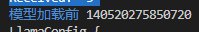

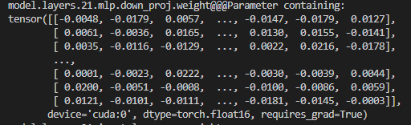

之后：

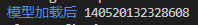

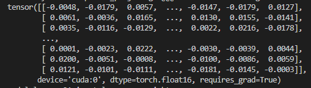

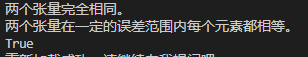

这delta也不为0啊：

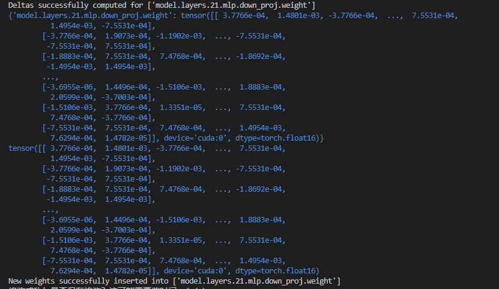

ft_main.py的51行


##### 5.14

最开始：

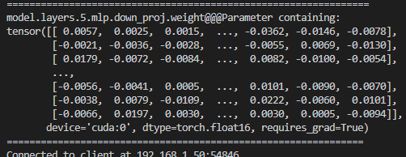


edited_model:

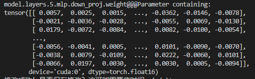


模型加载前：

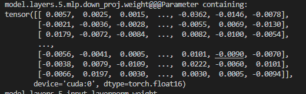

模型加载后

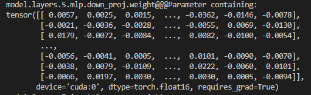


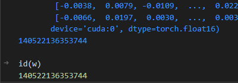

nethook得到的权重就是模型的权重地址一样140522136353744，


发现可能是EastEdit的问题。


模型id 140569494424496


层的id140569460717984

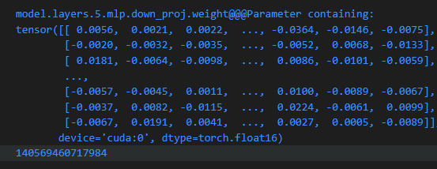


爽：
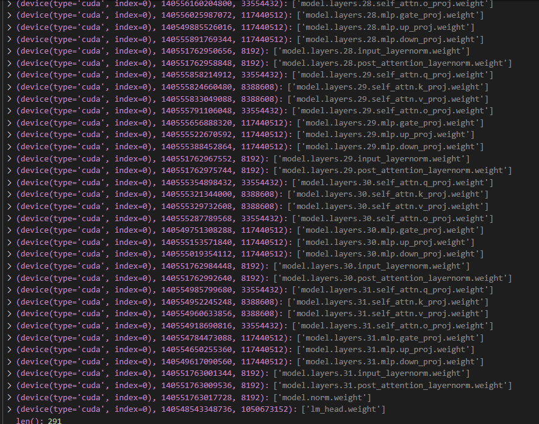

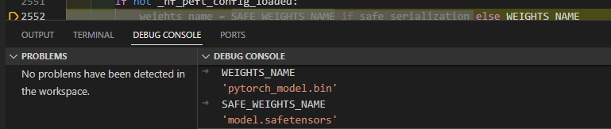


如果文件夹中有文件，则不删除，没有才删？

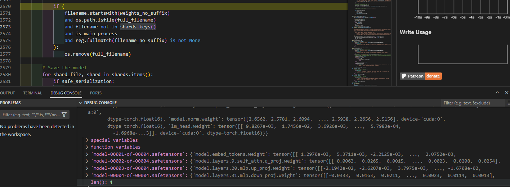


llama3  1-8,9-20,21-30, 31


重新load之后，还未更新MODEL引用：

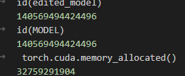

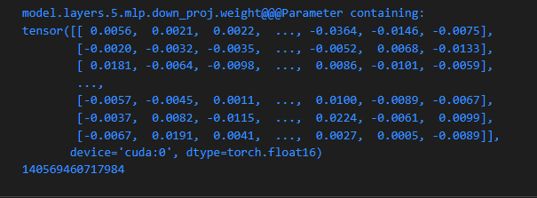

更新MODEL引用后，发现edited_mode还在。

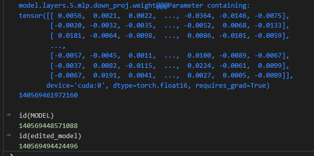

##### 5.15

今天测试了交互应用样例。"D:\1FromDesktop\study\0毕设\结题\修改效果样例测试.xlsx"

##### 5.16

听课。

ToG: prompt怎么可读。推理路径如何采样？

知识增强。知识图谱抽取数据来训练。

特朗普的女儿是谁。


数据的完善度。


##### 5.17

embedding层在哪里

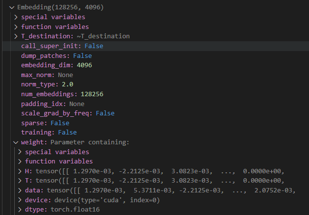

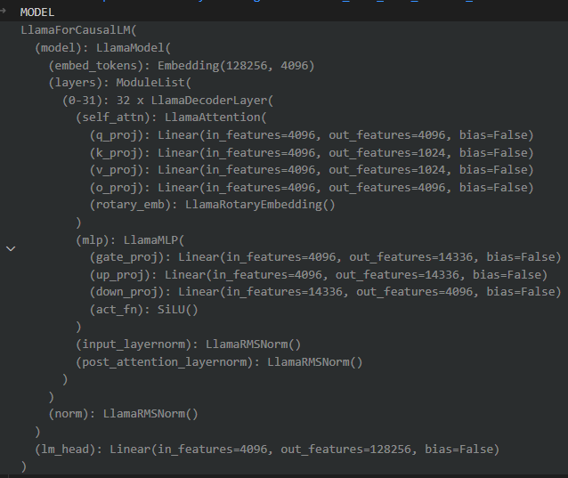

##### 5.22

```
”爱因斯坦样例“：
LLAMA3：[122, 980, 13, 16, 57, 171, 219, 391, 400, 386, 466, 598, 682, 840, 1140, 1643, 2134, 6988, 2694, 2555, 2914, 3131, 3235, 3649, 3794, 4514, 4740, 6030, 7066, 8937, 10844, 12457]
#发现17层突增

Mistral 7b

[461, 830, 1, 3, 0, 0, 6, 4, 163, 6, 1, 11, 7, 14, 207, 117, 442, 736, 1544, 4423, 3951, 3477, 3913, 4539, 4163, 4429, 6785, 7532, 9971, 12799, 15356, 19940]


```

##### 5.27
论文已交，over
准备加工加工投会议
